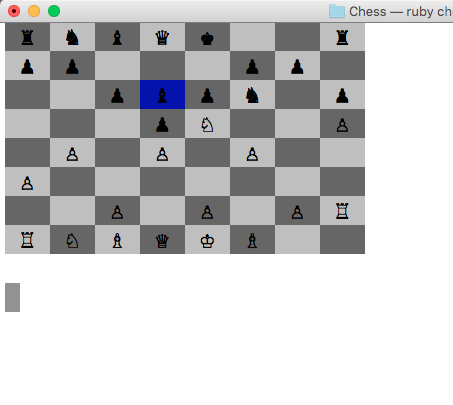

# Chess
##### The all-time classic written for the command line
play with a friend, against one of the custom built ai engines or watch the different ai algorithms compete.



## Installation
- download zip or
`git clone https://github.com/mmabraham/Chess\n`
`bundle install\n`
- difficulty can be customized by editing the `MAX_DEPTH` constant within any of the ai player files.

## Game play
`ruby chess.rb\n` to begin a game.
- The default settings will begin a game against the computer, with the human playing as white.
- running the game with the flag `-h` will start a game with 2 human players
- running the game with the flag `-c` will start a game with 2 computer players, with 'BFSPlayer' as white
- use the arrow keys or w s a d to move the cursor.
- space or enter to select or drop a playing piece.

## Features
- Two custom built ai engines of various difficulty
- Both use a min-max algorithm by interpreting into a single score the board layout that would result from every valid move.
- DFSPlayer internally creates a tree depth first, up to the desired depth. It then immediately sets the score for each node.
- BFSPlayer creates the tree breadth first, potentially allowing it to run on a concurrent thread while waiting for the opponent's input and looking up scores only when required to move.

## Implementation
- Every player class has the same API allowing the game to interact with all players polymorphically.
- Uses modules to extract methods common to several types of pieces and keep the code DRY. i.e. queen, rook and bishop include the slidable module.

```ruby
class Rook < Piece
  include Slidable

  def symbol
    :R
  end

  def value
    5 + super
  end

  private

  def move_dirs
    [[0, 1], [0, -1], [1, 0], [-1, 0]]
  end
end
```
